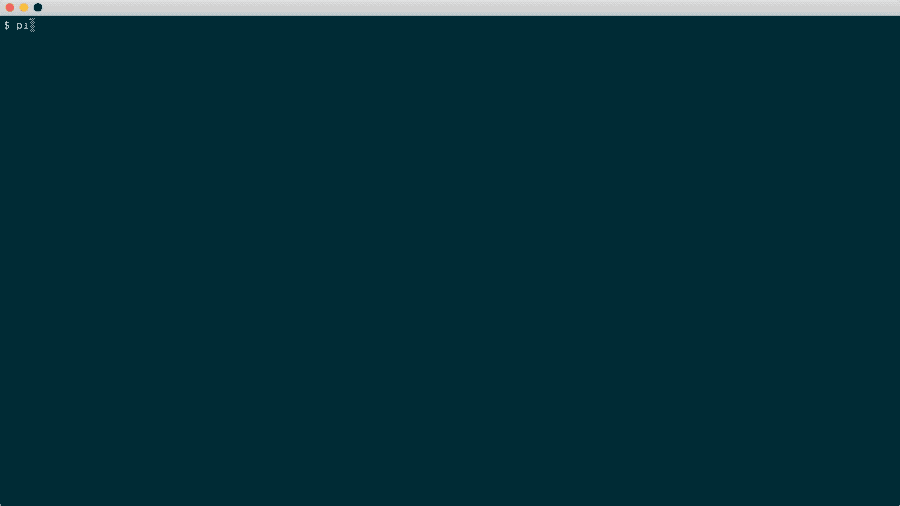

# Bento
Bento automatically tailors linters and static analysis with sane defaults on a per-project basis, letting you focus on writing code rather than configuring tools.

## Installation

### Requirements

Bento is supported on 
macOS Mojave (10.14) and
Ubuntu 18.04+

and requires
Python version 3.6 or later, and
pip3

Bento supports npm-packaged JavaScript and Python, and is ideal for monorepos.

### Installing Bento
Bento is a command-line tool that is simple to install:

```bash
pip3 install r2c-bento
```

## Usage
The workflow for Bento is:

1. Initialize Bento
2. Run Bento checks on your source code
3. Fix issues or archive unnecessary warning and errors
4. Disable undesired checks
5. Add Bento to git pre-commit hooks
6. Add Bento to the CI pipeline (e.g., CircleCI)

### Initialize Bento for a project:

In your project directory, run:

```bash
bento init
```

### Analyze your source code
To trigger Bento to analyze your project, run:

```bash
bento check
```

### Archive your 

The `archive` command whitelists outstanding issues to fix later. This lets you continue coding with a clean slate without having to address all your tech debt as soon as you adopt a new tool. New issues introduced from this point forward will be reported by Bento until the next time you run the `archive` command.

Archive issues by running:

```bash
bento archive
```

### Disable and enable individual checks
Enable/disable a specific check by running:

```
bento enable [OPTIONS] TOOL CHECK
```
or
```
bento disable [OPTIONS] TOOL CHECK
```
where:

* `TOOL` refers to the tool that includes the check, for example, `r2c.eslint`
*  `CHECK` refers to the label for the check you want to enable, for example `no-console`

Example: 

```
bento enable r2c.eslint no-console
```
You can find the tool and check names in the output of `bento check`. Bento currently supports the following tools:

| Language   | Supported Tools |
|------------|-----------------|
| Python     | bandit, flake8  |
| Javascript | eslint          |

If there are tools you'd like us to add, please let us know by creating an issue.

### Install Bento as a pre-commit hook
Bento can install itself as a pre-commit hook, so it runs before each commit and blocks on failures.

To install bento as a pre-commit hook, simply run:
```bash
bento install-hook
```

## Demo
Here’s a short preview of Bento in action:



## Terms of service and privacy
Please refer to the [terms and privacy document](https://github.com/returntocorp/bento/blob/master/PRIVACY.md).

## License
Copyright (c) [r2c](https://r2c.dev ).


